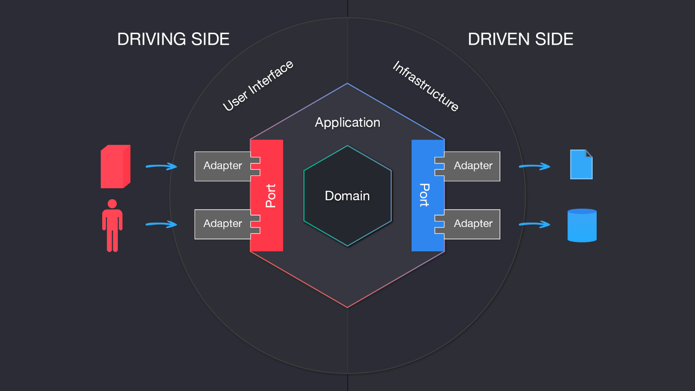

Bike Application
=================
About the project
-----------------

This project is about to build an application based on an API REST for a bike store.

The user is able to *create, update the information, delete and update the state (activate, deactivate and archive)* as well as *retrieving the information for one bike and for all the user's bikes*.


Chosen architecture
-------------------
The architecture chosen for developing this project is the **Hexagonal** one.

*Why did I made this choice?*
The answer is pretty easy; it respects the S.O.L.I.D. principles and allows to separate the different layers of the application.

I've structured my project using different *adapters* for the *driving side* to communicate via *ports* with the *application*, and *ports on the application* that communicate with the *driven side* via *ports on the application* isolating the *domain* of the application.



As a primary adapter I created one controller (`BikeApplication/src/Adapters/Controllers/BikeController.php`) that gets an manages every different request for performing the allowed actions.

This controller instantiates every service and calls the method on them for doing the desired action. In every function I made a validation of the input data from the `request` for making sure no incorrect data is introduced. If the data type doesn't match the desired one it throws an `exception`.

`BikeController` calls the function on the service passing a `DTO` with the desired data for assure scalability and *guarding the data types*. It uses the secondary adapter (`BikeApplication/src/Adapters/Repositories/DoctrineBikeRepository.php`) for performing the desired actions on the external actors (driven side); in this case would be persisting the data on the database.

Once the desired actions are done, the service returns another `DTO` with the desired data for the controller, isolating completely the `Domain` part of the application.

Tests
-----
Tests can be found on `BikeApplication/tests/Application/Services`. I only tested the services for making sure they do the desired actions.


Setup of the project
--------------------
**Requirements**: Docker Application

To install it first you need to clone the repository in your local machine:
```
git clone https://github.com/aaaaane/BikeApplication.git
```

Once you've done it go inside the folder using a terminal and execute:
```
docker-compose build
```

Once the query finishes, run:
```
docker-compose exec app composer install
```

Utilities
---------

For better usage of the API I've created a Postman Collection:
```
https://www.getpostman.com/collections/ab9a5c226c8e26bd3299
```
Make sure once you're ready to start using the API that you first send a create petition for having some data inside the database.
Once you have one or several bikes, use the desired bike (change it on the petitions) id for sending the requests.

